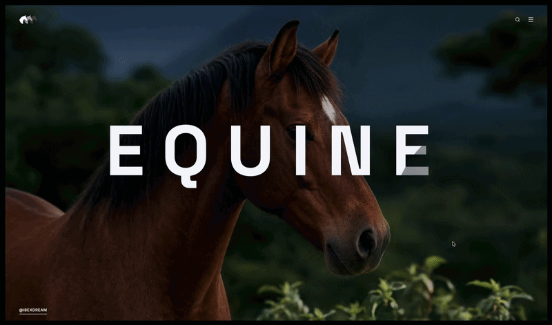

# Threefold



Threefold is an interactive cinematic hero experiment built around three visual identities layered into one scene: horse, unicorn, and zebra. The experience uses cursor-driven image reveals, soft trailing motion, liquid-like circle distortion, and playful throw physics for selected interface elements.

Live site: [ibexdream.github.io/threefold](https://ibexdream.github.io/threefold/)

## Concept

Threefold explores a layered identity reveal: the base horse remains visible, the unicorn follows the cursor with a slower elastic delay, and the zebra sits above it as the sharper foreground reveal. When the zebra reveal pushes into the unicorn reveal, the unicorn mask deforms and rebounds like a soft plastic bubble.

Creative pipeline:

```text
Midjourney -> GPT Image 2 -> Google AI Studio -> Codex
```

The Threefold logo was built in QuiverAI as a native SVG.

## Features

- Layered horse, unicorn, and zebra image reveal.
- Zebra reveal stays visually above the unicorn reveal.
- Unicorn reveal trails behind the cursor with elastic lag.
- Liquid-style unicorn distortion when the zebra circle pushes into it.
- Reveal circles keep working even when most of the circle is outside the viewport.
- Throwable logo and footer text with drag, release velocity, rotation, bounce, and friction.
- Search input projectile that flies into the page, can be dragged/thrown, validates empty text, and exits after sending.
- Menu links are launched into the page from above the viewport and exit when the menu closes.
- GitHub Pages deployment through GitHub Actions.

## Tech Stack

- React
- Vite
- TypeScript
- Tailwind CSS
- Lucide React icons

## Local Development

Install dependencies:

```bash
npm install
```

Start the development server:

```bash
npm run dev
```

Build the production version:

```bash
npm run build
```

Run the type check:

```bash
npm run lint
```

## Changing The Reveal Circles

The main circle settings live in:

```text
src/components/InteractiveRevealBanner.tsx
```

Look near the top of `InteractiveRevealBanner` for these constants:

```tsx
const ZEBRA_RADIUS = 204;
const ZEBRA_SOFTNESS = 0;
const UNICORN_RADIUS = 330;
const UNICORN_LAG = 0.04;
const MIN_VISIBLE_CIRCLE_FRACTION = 0.1;
```

`ZEBRA_RADIUS` controls the size of the zebra reveal circle. The visible diameter is twice the radius, so `204` means the zebra circle is about `408px` wide.

`UNICORN_RADIUS` controls the size of the unicorn reveal circle. It is intentionally larger than the zebra circle, so `330` means the unicorn reveal is about `660px` wide.

`ZEBRA_SOFTNESS` controls the edge softness of the zebra mask. `0` keeps the circle crisp. Larger values make the edge more feathered.

`UNICORN_LAG` controls how slowly the unicorn follows the cursor. Lower values create a heavier delay. Higher values make the unicorn catch up faster.

`MIN_VISIBLE_CIRCLE_FRACTION` controls how far outside the reveal area the cursor can move before the circles disappear. `0.1` means the reveal is allowed to keep working while roughly 10% of the larger circle remains visible.

For the liquid distortion, these constants are also important:

```tsx
const UNICORN_EDGE_CONTACT_DISTANCE = UNICORN_RADIUS - ZEBRA_RADIUS;
const UNICORN_DISTORTION_BAND = ZEBRA_RADIUS * 0.9;
const UNICORN_RELEASE_DISTANCE = UNICORN_RADIUS + ZEBRA_RADIUS;
const UNICORN_SHAPE_POINTS = 72;
```

`UNICORN_DISTORTION_BAND` changes how wide the contact zone feels before the unicorn starts deforming.

`UNICORN_SHAPE_POINTS` controls how many points are used to build the unicorn mask polygon. Higher values can look smoother, but cost more animation work.

## Drag And Throw Physics

The throw behavior is implemented in:

```text
src/App.tsx
```

The main throwable wrapper is:

```tsx
function ThrowableItem(...)
```

It is used for the Threefold logo and the `Follow me: @ibexdream` footer text. These elements can be dragged, released with velocity, rotated, bounced against the viewport edges, and slowed down with friction.

The throwable elements use pointer movement history to estimate release velocity. If you drag faster and release, the element flies farther. If it hits the browser edge, it bounces back into the screen with a rotated collision shape, so the bounce reacts more naturally when the element is angled.

The search bar uses a separate projectile component:

```tsx
function SearchProjectile(...)
```

It is launched from below the viewport when the search icon is clicked. It can also be dragged and thrown. If Send is clicked with an empty value, the input turns red and shakes. If Send is clicked with text, it turns green, shakes briefly, then runs offscreen.

The menu link animation is handled by:

```tsx
function FlyingMenuLinks(...)
```

The links are hidden by default. Clicking the menu icon launches them from above the viewport into random positions near the top of the page. Closing the menu throws them back out of the viewport.

## Assets

The public assets live in:

```text
public/
```

Current core assets:

- `1.jpg` - base horse layer
- `2.jpg` - zebra reveal layer
- `3.jpg` - unicorn reveal layer
- `threefold-logo-quiver.svg` - active Threefold logo
- `intro-gif.gif` - README intro preview

Because the project is deployed with GitHub Pages, asset paths are resolved through Vite's base URL handling in the app code.

## Deploying To GitHub Pages

This repository includes a GitHub Actions workflow:

```text
.github/workflows/pages.yml
```

To deploy:

1. Push the repository to GitHub.
2. Open the repository on GitHub.
3. Go to `Settings` -> `Pages`.
4. Set `Build and deployment` -> `Source` to `GitHub Actions`.
5. Push to the `main` branch or re-run the workflow from the `Actions` tab.

The workflow installs dependencies, runs the type check, builds the Vite app, uploads `dist`, and deploys it to GitHub Pages.

## License

This project is public and free to download from GitHub.
